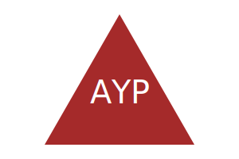

# SVG Logo Maker

## Table of Contents

 * [Description](#description)

 * [Live-Screen-Recording-of-Application-Functionality](#live-screen-recording-of-application-functionality)

 * [Examples of Generated Logos](#examples-of-Generated-Logos)

 * [Technologies-Used](#technologies-used)

 * [Installation](#installation)

 * [License](#license)

## Description

This application was built as a way to allow freelance web developers to create simple logos for their clients and projects so that they don`t need to pay a graphic designer. It utilizes inquirer to prompt the user within the command line for how they would like their logo to look (what text they would like their logo to display (up to 3 characters in length), the color of that text, the shape of their logo (triangle, square, or circle) and the color of that shape.) Once the user answers all prompts, then an SVG file is written using their selections to generate a logo. 

## Live Screen Recording of Application Functionality

https://drive.google.com/file/d/1GUMU1RPPZ1dRz-PFdK_435QYLJBqmG_D/view?usp=sharing

## Examples of Generated Logos

## Technologies Used

This project is powered by Node.js v16, utilizes inquirer v8.2.4 (node package manager), and file system module (node package manager). It also employs jest v29.5.0 (node package manager) for the unit testing conducted in this application. 

## Installation

1. Clone the repo:
   git clone https://github.com/usflfelipe/svg-logo-maker

2. Open in VS Code. If you do not have VS code you must install it.

3. Using the terminal, install node.js v16. If you have homebrew, the command should look like the following (brew install node@16), however this may vary and the documentation should be consulted.

4. Once node.js v16 is installed, in the terminal, utilize the command npm init -y to initialize and create a package.json where project files will be stored.

5. Next, use the terminal to run the command npm i to install the dependencies associated with this application (developers may need to install inquirer and jest directly from the command line, to do so the command for inquirer will be npm i inquirer@8.2.4 to install v8.2.4 of the inquirer, and npm i jest to install the latest version of jest).

6. To run the application, within the terminal, type the command node index.js.
 

## License

NOTICE: This application is covered under the MIT License
